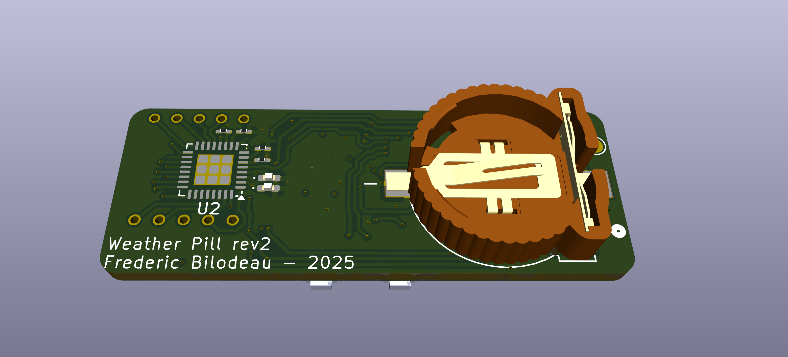

### A small and compact weather logging station to use for outdoor adventures

The goal is to log the temperature, humidity, while having it displayed on a small lcd 

The battery life is expected to be 2 years on a CR2032

This is the Rev2, which is currently being tested as of August 2025

